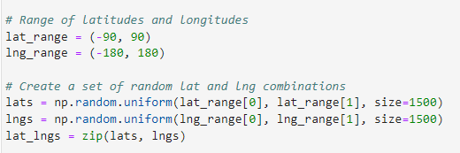
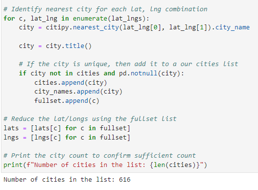
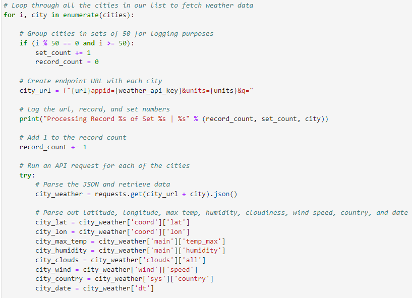
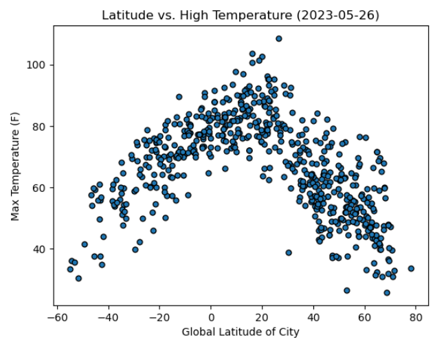
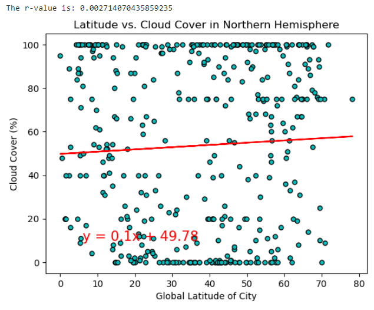
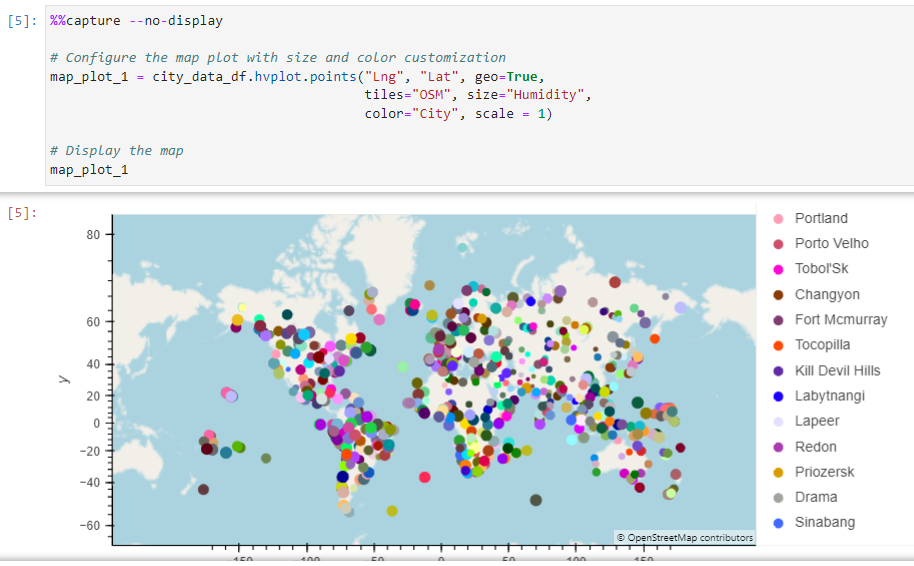

**UCB Data Analysis Module 6**
## Python-API Challenge: OpenWeather Map & Geoapify API

---------------
#### Purpose:
Use geoViews, OpenWeatherMap and Geoapify APIs to answer the question: "What is the weather like as we approach the equator?"  In other words, prove that temperature increases as we approach the equator...supported by data.  

Step 1. Start by generating a random list of latitude/longitude combinations.  

Step 2. Use citypy to assign nearest city to each set of coordinates.  

Step 3. Retrieve weather data for each city using OpenWeatherMap API.  

Step 4. Generate scatter plots to examine relationship between latitude and temp/humidity/cloud cover/wind. (example below)   

Step 5. Perform linear regression for each of the above. (example below)  

Step 6. Use Geoapify API and geoViews library to plot the data (i.e. map data)  

--------------
#### Contents of Repository:
- WeatherPy Folder
    - 1 x Jupyter Notebook:  WeatherPy_rjh.ipynb
    - Folder for output_data
       - 4 x .pmg image files (linear regression scatter plots)
       - 1 x .csv export data file (generated by WeatherPy_rjh.ipynb)
- VacationPy folder
    - 1 x Jupyter Notebook: VacationPy_rjh.ipynb
- README file

-------------------
#### Contributions:  
Code: date = pd.to_datetime(date_unix, unit='s').strftime('%Y-%m-%d')  
File:  WeatherPy_rjh.ipynb  
Contributor: Stack Overflow User, mhhabib  
URL: https://stackoverflow.com/questions/65016116/pandas-converting-a-datetime-y-d-m-hm-to-y-m-d-hm  
Posted:  11/26/2020 @ 5:11  

------------------
#### License:
[MIT](https://choosealicense.com/licenses/mit/)
